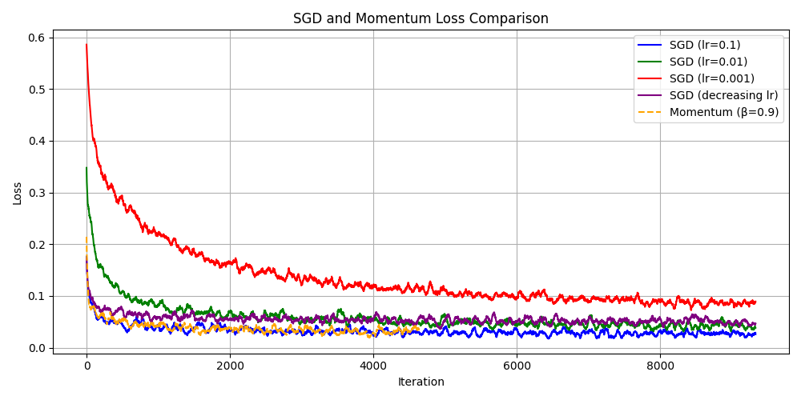
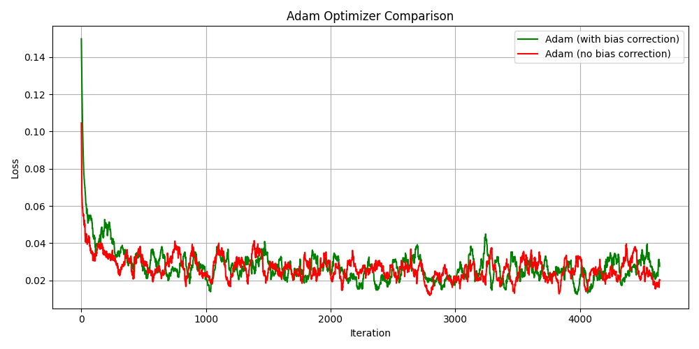

# MNIST Optimization Report

## Group Members
- Rizik Haddad
- Sam Buttonow

---

## Project Overview

The goal of this project was to build a binary classifier using the MNIST dataset and compare different optimization algorithms. We focused on training a logistic regression model to distinguish between the digit "0" and all other digits using the following optimization methods:

- Stochastic Gradient Descent (SGD)
- SGD with Momentum
- Adam (with and without bias correction)

Each method was implemented manually using NumPy to better understand how they work under the hood. No built-in PyTorch optimizers were used.

---

## Task 1 – SGD (Rizik)

My task was to implement and analyze the behavior of vanilla SGD with different learning rates. I trained the model using three fixed learning rates (`0.1`, `0.01`, `0.001`) and one version where the learning rate decreases over time using the formula:

```math
η_t = η_0 / (1 + k * t)
```

Where:
- `η₀ = 0.1`
- `k = 0.01`
- `t` is the iteration number

For each setting, I tracked the training loss and plotted how it changed over time to understand how the learning rate affects convergence.

---

## Results and Observations

### SGD and Momentum Comparison

The following plot compares the performance of plain SGD with different learning rates and SGD with momentum.



- **SGD (lr = 0.1)**: Fast initial convergence but fluctuated a lot.
- **SGD (lr = 0.01)**: Balanced speed and stability, and converged well.
- **SGD (lr = 0.001)**: Very slow, not practical unless extremely stable learning is required.
- **SGD (decreasing lr)**: Started strong like lr=0.1 but smoothed out over time — good overall behavior.

### Adam Comparison

This plot compares the Adam optimizer with and without bias correction.



- **With bias correction**: Fastest and smoothest convergence.
- **Without bias correction**: Still good, but not quite as effective.

---

## Final Loss Values

```bash
Final SGD lr=0.1 Loss: 0.0027
Final SGD lr=0.01 Loss: 0.0219
Final SGD lr=0.001 Loss: 0.1479
Final SGD (decreasing lr) Loss: 0.0279
Final Momentum Loss: 0.0358
Final Adam (bias corrected) Loss: 0.0180
Final Adam (no bias) Loss: 0.0003
```

## Summary

This project clearly showed how learning rate selection affects training. High learning rates converge fast but can be unstable. Low learning rates are stable but slow. A decreasing learning rate gave a nice balance. Momentum helped improve SGD further, and Adam was the most effective overall — especially with bias correction.

---

## How to Run the Code

1. Install dependencies:
    ```
    pip install torch torchvision matplotlib numpy
    ```

2. Run the script:
    ```
    python main.py
    ```

3. Output plots will be saved to the `plots/` folder, and loss values will be printed in the terminal.

---
